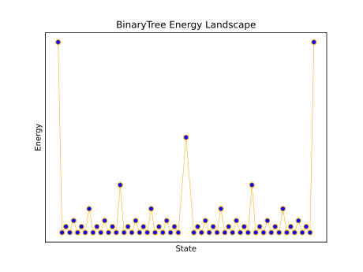

# Fractal Landscapes

Python code to generate complicated energy landscapes tuned by temperature.



## Example usage

One can either look at the `plot_landscape.py` example script or use the following syntax to generate a `TreeLandscape`:

```python
import tree_landscapes as TL

# Construct a TreeLandscape. Defaults to a BinaryTree.
my_tree_energy = TL.TreeLandscape()

# Extract out the sorted x and y values of the nodes.
# One can plot these directly to see the landscape
# before further processing.
xvalues, yvalues = my_tree_energy.export_landscape()
```

See the `plot_landscape.py` script for the specific source code used to plot the example above.
